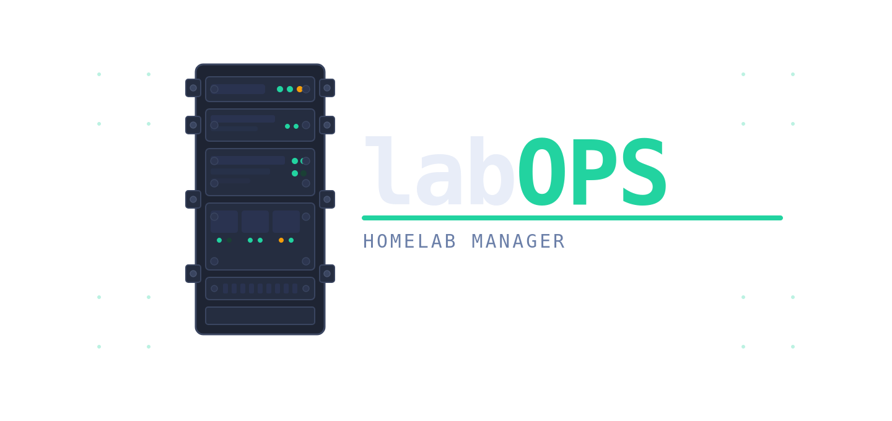

A declarative, YAML-based homelab manager. `labops` is a CLI tool designed to simplify, automate, and standardize the setup, configuration, and maintenance of your homelab infrastructure utilizing simple configuration files and powerful backend automation.

## Features

### Current Capabilities
- **Declarative YAML Configuration**: Define your complete homelab environment comprehensively using simple YAML configuration files.
- **Host Management**: Automated setup, initialization, and system updates for a variety of host operating systems (Alpine, Debian, RedHat) powered by integrated Ansible playbooks.

### Roadmap & Future Scope
- **Docker Stack Management**: Seamlessly deploy, spin up, and manage Docker Compose stacks across your nodes.
- **Proxmox LXC**: Update Proxmox Linux Containers (LXC) natively.
- **DNS Automation**: Automated updating of internal DNS records.
- **Reverse Proxy Orchestration**: Manage, update, and automate reverse proxy routes

## How it Works

`labops` acts as a bridge between simple, human-readable YAML configurations and powerful Ansible Commands. 

1. **Configuration parsing:** It reads a declarative `.yml` inventory representing your homelab layout, target servers, credentials, and settings.
2. **Validation:** It validates the YAML structure and data format to stop misconfigurations early.
3. **Execution:** Based on the commands executed, it triggers internal Python routines or dispatches built-in Ansible playbooks targeting the defined hosts. This ensures consistent host setups, OS updates (Debian, RedHat, Alpine), and more without writing raw playbook files manually.

## Installation

You can install `labops` easily via pip:

```bash
pipx install labops
#or
pip install labops
```
*Since `labops` is a standalone CLI tool, using [pipx](https://pipx.pypa.io/) is highly recommended to isolate its dependencies*

## Usage

Once installed, the `labops` command becomes available. Point it to your YAML configuration file (e.g., `test-samples/homelab-complete.yml`):

```bash
# View all available CLI commands
labops --help

# Example: Run a setup routine for all hosts
labops host update all
```

## Development & Building

This project utilizes [Dev Containers](https://containers.dev/) to provide a seamless, consistent development environment, and uses [uv](https://github.com/astral-sh/uv) for lightning-fast Python package management.

### 1. Development Environment

To start developing locally without installing system-level dependencies:

1. Open the project in VS Code (or any editor supporting Dev Containers).
2. When prompted, click **Reopen in Container** (this builds your development environment with Python, Ansible, and other necessary CLI tools pre-installed).
3. Once the container is running and your terminal is open, sync the dependencies and activate the virtual environment:

```bash
# Create the virtual environment and install dependencies + the labops CLI
uv sync

# Activate the virtual environment
source .venv/bin/activate

# Now you can run the CLI
labops --help
```

### 2. Building the Package
The package does not have to be manually updated to PyPi, as it utalizes github actions to build and publish it.

To build the standard Python distribution files locally (Wheel `.whl` and Source Distribution `.tar.gz`) for testing:

```bash
uv build
```

This will generate the artifacts inside the `dist/` directory.
